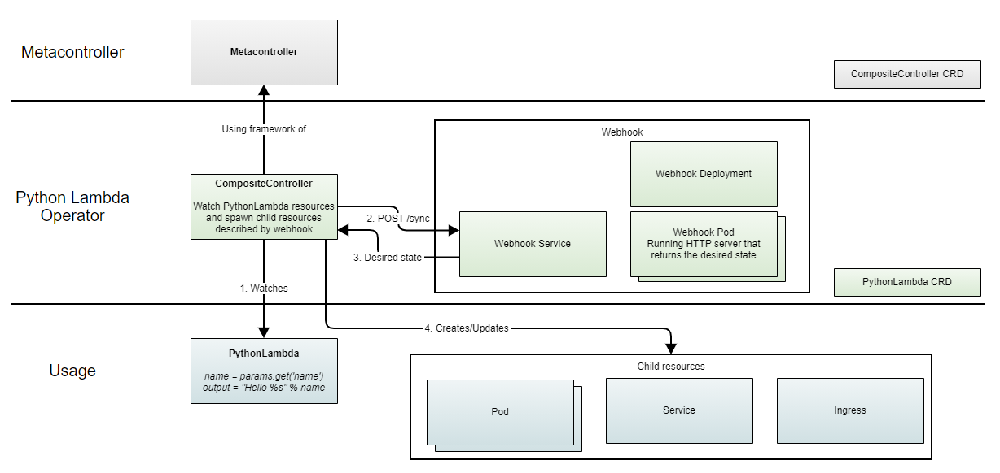

# Python Lambda operator

This repo contains a Kubernetes operator built with [Metacontroller](https://github.com/metacontroller/metacontroller).  
By supplying a Kubernetes manifest of type PythonLambda, the operator will run `n` HTTP servers running user-supplied python code.
It's built for demo purposes only. Do not use in production.

### Warning
Again, it's built for demo purposes only. Do not use in production.

## Architecture
The architecture roughly works as follows:



## Installation
Prerequisites:
1. Metacontroller should be installed on Kubernetes
2. Install Certmanager, Ingress controller and ExternalDNS should be installed if you want to get Ingress working
   
Installation:
1. Navigate into the operator directory and apply `namespace.yaml` to Kubernetes. 
2. Apply all other YAML files from that directory.

## Usage

Apply a `PythonLambda` manifest on the cluster. The following is an example:

```yaml
apiVersion: example.com/v1
kind: PythonLambda
metadata:
  name: demo-python-lambda
  namespace: python-lambda-operator
spec:
  code: |
    name = query_params.get("name", ["World"])[0]
    reverse_name = name[::-1]
    output = "Hello %s! Your name in reverse is %s" % (name, reverse_name)
  replicas: 2
  host: example.com
```
